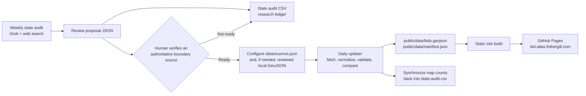

# BID Atlas data operations

This document explains how BID Atlas researches national coverage, promotes verified districts into the map, refreshes published data, and deploys the site.

The system deliberately separates **research** from **publication**. An LLM may identify laws, registries, district websites, and possible boundary sources, but it cannot add a district to the public map. A person must verify and configure every published source.

## End-to-end flow



There are three related but distinct activities:

1. **State audit:** finds and documents possible coverage using an LLM and cited web research.
2. **Source promotion:** a human verifies a source and adds it to the maintained source configuration.
3. **Daily refresh:** deterministically updates already-approved sources and deploys the site. It does not use an LLM.

## Systems of record

| File | Purpose | Public map input? |
| --- | --- | --- |
| `data/state-audit.csv` | One research-status row for every state and the District of Columbia | No |
| `data/audit-proposals/{STATE}.json` | Cited LLM research proposal requiring review | No |
| `data/audit-proposals/_latest-run.json` | States included in the most recent research run | No |
| `data/candidate-sources.json` | Data.gov discovery leads requiring review | No |
| `data/sources.json` | Approved source configuration used by the updater | **Yes** |
| `data/*-verified-bids.geojson` | Human-reviewed local geometry for sources without a reliable live GIS feed | **Yes, when referenced by `data/sources.json`** |
| `public/data/bids.geojson` | Generated, normalized map features | **Yes; loaded by the website** |
| `public/data/manifest.json` | Generated counts, source health, freshness, and change summary | **Yes; loaded by the website** |
| `data/last-change-report.json` | Generated detailed added/modified/removed record report | Administrative only |

The website loads `public/data/bids.geojson` and `public/data/manifest.json`. It does not load audit proposals or `data/state-audit.csv`.

## State-audit process

### Schedule and configuration

The `Research state BID coverage` workflow is defined in `.github/workflows/state-audit.yml`.

- Scheduled every Monday at `14:41 UTC`.
- Can be started manually with an optional comma-separated list of state codes and a maximum-state limit.
- Defaults to three states per run.
- Uses the `LLM_API_KEY` GitHub Actions secret.
- Uses configurable `LLM_API_URL`, `LLM_MODEL`, `LLM_MAX_TOKENS`, `LLM_TIMEOUT_MS`, and `LLM_REASONING_EFFORT` repository variables.
- The current defaults are the xAI Responses endpoint and `grok-4.5`.

If no states are specified, `scripts/audit-states.mjs` selects incomplete audit rows. Unresearched or overdue rows are considered first, followed by the least recently researched rows.

### What the model researches

For each selected state, the script asks the model to investigate three areas:

1. State enabling law and locally used legal terms.
2. State or local government lists and registries.
3. Official GIS, open-data, ordinance, and boundary sources.

The xAI Responses API performs native web searches during the research call. The model returns structured JSON containing:

- authority and registry status;
- applicable local terms such as BID, Special Service Area, or Special Improvement District;
- candidate local sources and whether they appear to contain boundaries;
- coverage and confidence assessments;
- recommended next action and research notes;
- URLs used as evidence.

### Research guardrails

The research output is intentionally conservative:

- Search results are treated as untrusted content.
- Government statutes, registries, GIS, ordinances, and official district pages are preferred.
- A failed search is not treated as proof that no BID exists.
- Similarly named but legally unrelated districts must be excluded.
- A state is not marked complete unless authoritative statewide coverage is demonstrated.
- Every URL retained in a proposal must appear in the API's returned web-search citations. Unsupported URLs and candidate sources are removed.
- Proposals are always marked `review_required: true`.

### Generated proposal and review branch

Each result is written to `data/audit-proposals/{STATE}.json`. The workflow then runs `admin:audit:apply` on its temporary branch, which copies the proposed findings into the matching rows of `data/state-audit.csv` and sets the next review date 90 days later.

The workflow opens a pull request containing:

- the detailed proposal JSON;
- the proposed `data/state-audit.csv` changes.

It does **not** modify `data/sources.json`, add geometry, or publish a map record.

### Human review checklist

Before merging an audit pull request, an administrator should verify:

1. The cited law is current and actually authorizes a BID or a defensible legal equivalent.
2. Each named district is active, not merely proposed, historical, or expired.
3. Similarly named redevelopment, zoning, tourism, residential, or infrastructure districts are excluded unless they function as the project's defined BID equivalent.
4. Registry and district counts are supported by current primary sources.
5. Candidate boundary links contain the claimed district and are not unrelated GIS layers.
6. `coverage_status`, `confidence`, `next_action`, and notes accurately describe what remains unknown.

Merging the pull request updates the national research ledger. It still does not add anything to the public map.

## How audit output reaches the map

Promotion from audit lead to public map source is a separate, human-controlled task:

1. Choose a candidate from the proposal or the `known_local_sources` field in `data/state-audit.csv`.
2. Verify the district's active legal status and its official boundary.
3. Prefer a current official GeoJSON or ArcGIS boundary feed.
4. If no live GIS exists, digitize the official legal map into a reviewed repository GeoJSON and label generalized geometry honestly.
5. Add an entry to `data/sources.json` defining state, city or per-feature city field, publisher, landing page, field mappings, and update cadence.
6. For local GeoJSON, add stable official `monitorUrls` so changes to ordinances or plans trigger review.
7. Run the updater, inspect the generated feature and source health, visually compare the boundary with the official map, and run the tests.
8. Commit the reviewed source configuration and geometry to `main`.

Once merged, a push-triggered refresh runs immediately. The same source is thereafter checked by every daily refresh.

This manual bridge is intentional. It prevents an LLM research mistake, an ambiguous district name, or an approximate boundary from becoming public data automatically.

## Daily refresh and deployment

### Triggers

The `Refresh and deploy BID Atlas` workflow is defined in `.github/workflows/update-and-deploy-pages.yml`.

It runs:

- daily at `13:17 UTC`;
- after every push to `main`;
- when started manually.

The workflow uses a single non-cancelling concurrency group so refresh/deployment runs do not overwrite one another.

### Step 1: discover possible new public datasets

`npm run admin:discover` searches the federal Data.gov catalog for BID and community-benefit-district datasets. It writes `data/candidate-sources.json`.

These are only discovery leads. They are not fetched by the map updater until a person verifies them and adds an approved entry to `data/sources.json`.

### Step 2: refresh approved sources

`npm run admin:update` reads every entry in `data/sources.json`.

For a live GIS source, it:

- downloads the official GeoJSON or ArcGIS query result;
- maps provider-specific fields to the common BID schema;
- converts configured source coordinate systems to WGS84 longitude/latitude;
- calculates bounds and a map center;
- assigns a stable ID based on state, city, and district name;
- fingerprints attributes and geometry for change detection.

For a reviewed repository GeoJSON, it:

- reads the local geometry;
- downloads every configured official monitoring document;
- hashes those documents;
- marks the source `review` when the documents change, while retaining the last reviewed geometry.

Features with the same stable ID are combined into a multipolygon. The final features are sorted consistently.

### Step 3: handle changes and failures safely

The updater compares new record hashes with the previous published file and reports added, modified, and removed IDs.

If a source cannot be downloaded, returns no usable features, or has a failed monitoring document:

- the source is marked `error` in the manifest;
- the last successfully published records for that source are retained;
- an empty or partial response does not silently erase the district from the map.

The updater exits non-zero if any source failed. The workflow deliberately continues so it can publish the retained last-good data and expose the unhealthy source in the manifest. Operators should still investigate every `error` or `review` status.

### Step 4: generate published data

The updater writes:

- `public/data/bids.geojson`: all normalized district records and boundaries;
- `public/data/manifest.json`: source health, record/state/city counts, generation time, and change summary;
- `data/last-change-report.json`: detailed added, modified, and removed IDs plus per-source results.

### Step 5: synchronize the audit ledger

`npm run admin:audit:sync` counts configured sources and generated map records by state and writes those numbers into `data/state-audit.csv`.

This is the only automatic connection from published data back to the audit ledger. It updates `map_source_count` and `map_record_count`; it does not change research conclusions or promote candidate sources.

### Step 6: commit generated data

If any generated files changed, the workflow creates a `data: refresh BID directory` commit and pushes it to `main`. It includes:

- public map data and manifest;
- the change report;
- Data.gov discovery candidates;
- synchronized audit counts.

The workflow continues to deployment in the same run, so it does not depend on the bot-authored commit triggering another workflow.

### Step 7: build and deploy GitHub Pages

The site is built as a static GitHub Pages artifact. The export process:

- renders the application;
- copies browser assets and generated data;
- writes `.nojekyll`;
- writes the `CNAME` for `bid-atlas.fothergill.com`;
- checks for invalid asset paths.

GitHub's Pages deployment action then publishes the artifact. Visitors subsequently load the generated GeoJSON and manifest from the deployed site.

## Normal operator commands

```bash
# Research specific states locally using .env
node --env-file=.env scripts/audit-states.mjs --states=IN,IA,KS --limit=3

# After reviewing proposal JSON, apply selected findings to the CSV
npm run admin:audit:apply -- --state=IN,IA,KS

# Refresh source and record counts in the CSV
npm run admin:audit:sync

# Discover Data.gov leads
npm run admin:discover

# Refresh all approved map sources
npm run admin:update

# Build the site and run the complete test suite
npm test
```

## Operational checks

After a daily or manual run, verify:

1. The workflow and GitHub Pages deployment completed.
2. Every source in `public/data/manifest.json` is `ok`, or an understood `review` state is awaiting action.
3. Any source marked `error` retained its previous records and has an actionable error message.
4. `data/last-change-report.json` contains plausible additions, modifications, and removals.
5. Large count changes are reconciled with the publisher before being accepted as real.
6. Newly integrated boundaries are visually checked on the live map against their official source.

The daily job keeps approved sources fresh. The state audit expands and measures coverage. Human verification is the controlled handoff between those two responsibilities.
