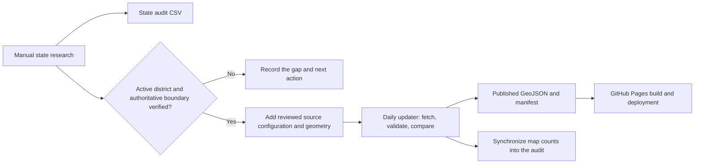

# BID Atlas data operations

This document explains the current production workflow for researching coverage, publishing verified districts, refreshing approved data, and deploying the site.

The production process is deliberately deterministic. State research and new boundary creation require human review; scheduled jobs only refresh sources that have already been approved.

## End-to-end flow



## Systems of record

| File | Purpose | Public map input? |
| --- | --- | --- |
| `data/state-audit.csv` | Research status for every state and the District of Columbia | No |
| `data/candidate-sources.json` | Data.gov discovery leads requiring human review | No |
| `data/sources.json` | Approved source configuration used by the updater | **Yes** |
| `data/*-verified-bids.geojson`, `data/*-automated-bids.geojson` | Reviewed local geometry referenced by an approved source | **Yes** |
| `public/data/bids.geojson` | Generated normalized district features | **Yes** |
| `public/data/manifest.json` | Generated counts, source health, freshness, and change summary | **Yes** |
| `public/coverage.html` | Generated public view of the state audit | **Yes** |
| `data/last-change-report.json` | Generated additions, removals, and modifications | Administrative only |

## Manual state research

For each state:

1. Verify the enabling statute and locally used terms.
2. Look for an authoritative statewide registry. A failed search is not evidence that no BID exists.
3. Identify active districts using current municipal records, assessment records, ordinances, official district pages, and government GIS.
4. Distinguish BIDs and defensible legal equivalents from unrelated redevelopment, zoning, residential, tourism, and infrastructure districts.
5. Record known sources, confidence, gaps, and the next action in `data/state-audit.csv`.
6. Run `npm run admin:audit:sync` after changing published sources or geometry so map counts remain accurate.

The coverage page is regenerated from the CSV during every build. Known but unmapped districts therefore remain visible without implying that an unverified boundary is publishable.

## Adding a district

A district may be added only after a person confirms that it is active and that the proposed geometry represents its legal or officially published boundary.

1. Prefer an official GeoJSON or ArcGIS polygon endpoint.
2. If only an ordinance, PDF, image, or parcel list exists, document how the geometry was derived and label generalized boundaries honestly.
3. Add the reviewed GeoJSON file when local geometry is required.
4. Add an entry to `data/sources.json`, including the official landing page, publisher, field mapping, and monitoring URLs.
5. Run `npm run admin:update` for the new source.
6. Run `npm run admin:audit:sync`.
7. Run `npm test` and visually compare the published overlay with the authoritative source before committing to `main`.

## Daily refresh

`Refresh BID Atlas data` in `.github/workflows/refresh-bid-data.yml` runs daily at `13:17 UTC`.

The workflow:

1. Runs `npm run admin:discover` to update Data.gov research leads.
2. Runs `npm run admin:update` to refresh every approved source.
3. Runs `npm run admin:audit:sync` to synchronize published counts.
4. Commits generated changes directly to `main`.

The updater fingerprints attributes and geometry. If a source fails, returns no usable features, or has a changed monitoring document, it retains the last good published records and records an `error` or `review` status rather than silently removing the district.

## GitHub Pages deployment

`Deploy BID Atlas to GitHub Pages` in `.github/workflows/update-and-deploy-pages.yml` runs on every push to `main`, after a successful scheduled refresh, or when started manually.

The build:

- generates `public/coverage.html` from the state audit;
- renders the application and copies static assets;
- writes `.nojekyll` and the custom-domain `CNAME`;
- validates asset paths;
- deploys `dist/pages` to GitHub Pages.

The custom domain is `bid-atlas.fothergill.com`. GitHub Pages must use **Settings → Pages → Build and deployment → Source: GitHub Actions**.

## Normal operator commands

```bash
# Discover public-data leads
npm run admin:discover

# Refresh all approved sources
npm run admin:update

# Refresh only one approved source
npm run admin:update -- --sources=idaho-verified-business-improvement-districts

# Synchronize source and record counts in the state audit
npm run admin:audit:sync

# Build the site and run the complete test suite
npm test
```

## Operational checks

After a refresh or deployment, verify:

1. The refresh and GitHub Pages workflows completed successfully.
2. Every source in `public/data/manifest.json` is `ok`, or an understood `review` state is awaiting action.
3. Failed sources retained their previous records and expose an actionable error.
4. Count changes in `data/last-change-report.json` are plausible and supported by the publisher.
5. Newly added boundaries match their authoritative source on the live map.

The retired experimental AI state-research and boundary-generation implementation is preserved on the `codex/ai-bid-automation-archive` branch.
